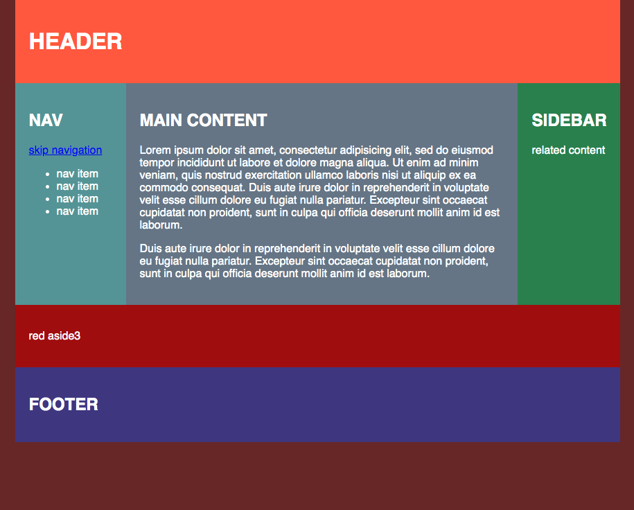
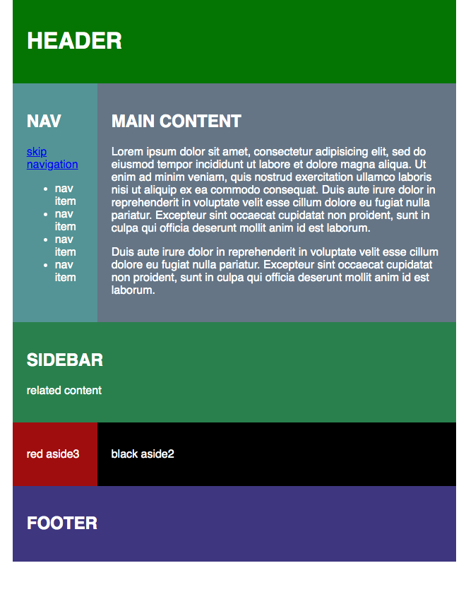
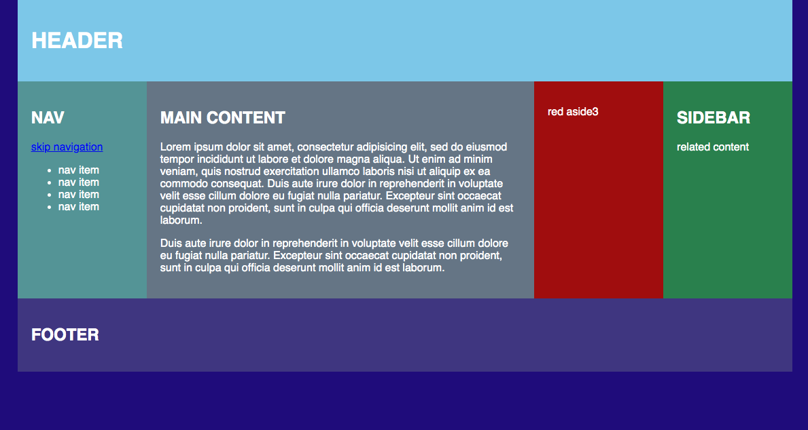

# Responsive Grid Layout Example
## Description
This is a responsive website design that uses three different media widths:
- Up tp 700px
- 701 to 999px
- 1000px +

This multi-column layout was designed using a mobile first approach and is a good starting point for mocking up a responsive website. Beware the colours are hard on the eyes! 

